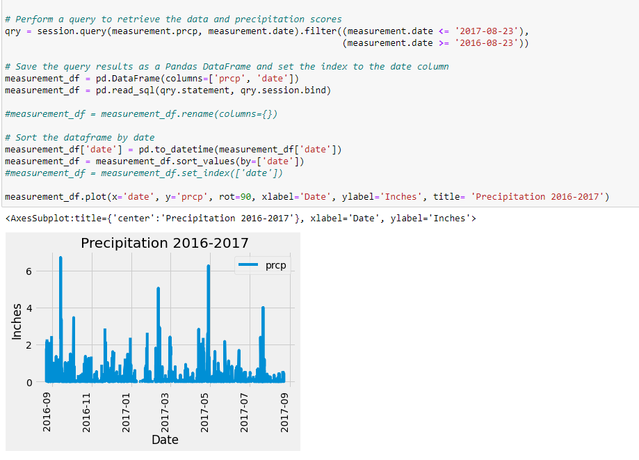
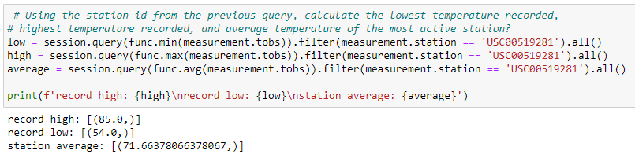
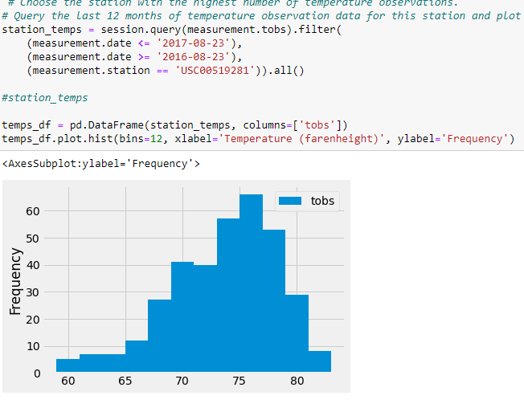

# sqlalchemy-challenge
 
The goal was to practice querying using sqlalchemy in jupyter notebook. This was a relatively easy assignment that was made tricky by syntax errors. My progress was slow at first but I picked up lots of speed towards the end.

The first bar graph looks like this:

This particular section was very hard for me, but once I figured it out I finished the rest of the assignment pretty quickly:

This was the final histogram. I wasn't able to get the labels to work perfectly:

I feel a lot more comfortable working with sqlalchemy now. 